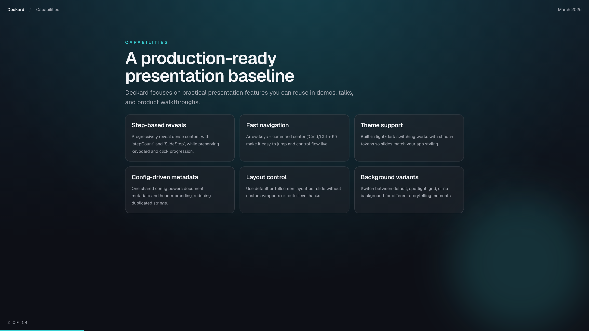
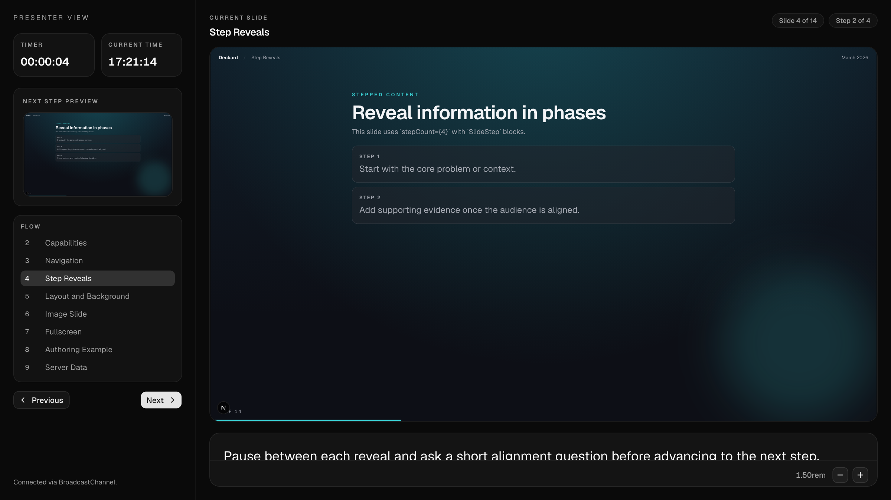

# Deckard

Presentations built out of React components: fixed layouts, speaker notes,
themes, and PDF export.

A slide is a React component. A chart, a live demo, a
form, or an awaited database query goes on a slide the same way it goes in an
app, because a deck is a Next.js app: routes, Server Components, your
components, your styles.

Deckard supplies the parts a presentation needs and an app does not. A fixed
1920x1080 canvas that scales to whatever screen it lands on, so a slide looks
the same on a laptop, a projector, and in the exported PDF. Keyboard
navigation, step reveals, a command menu, and a presenter window carrying your
notes. Themes you can take ownership of the moment you want to.





## Start a deck

```bash
npx @thebuilder/deckard-cli init my-talk
cd my-talk
npm run dev
```

That writes a Next.js app, installs it, commits it, and typechecks it. Open
`deck/slides.tsx`, where the sample deck is yours to delete.

`init` takes `--theme <name>` for any built-in, `--empty` to skip the sample
deck, and `--no-install` or `--no-git`. Run `deckard --help` for the names, or
read the [theme gallery](https://deckard.thebuilder.dk/themes). It asks no
questions. It installs with whichever package manager ran it, and writes no
`packageManager` field, so nobody who clones your deck is locked to your choice.

## What a deck looks like

```tsx
// deck/slides.tsx
export const slides: SlideDefinition[] = [
  {
    slug: "intro",
    title: "What we shipped",
    notes: "Speaker-only. Reaches the presenter window, never the room.",
    body: <HeroSlide eyebrow="Q1 review" />,
  },
  {
    title: "Adoption",
    body: <AdoptionChart />,
  },
]
```

An array of objects with a `body`. Everything else is optional. The fourth
slide is served at `/slides/4` unless you give it a `slug`, and a slide that
outgrows the array moves to `deck/slides/<name>.slide.tsx`, where it can await
data before it renders. Discovery picks those files up. The array still decides
the order.

## The packages

| Package | What it holds |
| --- | --- |
| `@thebuilder/deckard-core` | the deck contract, the canvas, the shell, navigation, presenter mode, the route adapters |
| `@thebuilder/deckard-themes` | the built-in themes, imported rather than installed, ejected into your repo when you want to edit one |
| `@thebuilder/deckard-cli` | the `deckard` binary: scaffold, validate, screenshot, export |

A theme is one import. Write `theme: nexus` in `deck/deck.ts` and the deck is a
flight console; run `deckard add theme phosphor` and it is a green CRT.
`deckard eject theme` copies the source into `deck/theme/` and it is yours from
then on.

A theme that comes from a design set in a real face carries that face: Chivo and
Azeret Mono for blueprint, Source Serif 4 and Public Sans for ledger, Schibsted
Grotesk for meridian, Orbitron and IBM Plex for nexus, JetBrains Mono for
phosphor, the IBM Plex family for quorum. Every one is SIL Open Font
License 1.1 and ships inside the package, subset and self-hosted, so a deck
renders offline and never calls a font host. A theme on a system stack downloads
nothing, and a deck only pays for the theme it uses.

Slide blocks are the other half, and they work the other way around. Those
install as source through the shadcn registry, because a layout is something
you edit.

## Documentation

The docs site is [deckard.thebuilder.dk](https://deckard.thebuilder.dk), built from
`apps/docs`. To run it locally:

```bash
pnpm --filter docs dev
```

It covers writing slides, the canvas, presenting, themes and the token
contract, the CLI, and the deck config. `AGENTS.md` and
`.claude/skills/slide-authoring/SKILL.md` are the same material written for
coding agents.

## Working on Deckard

A pnpm workspace on Turborepo. Node 20.9 or newer, the floor the packages
declare in `engines` and `deckard doctor` checks. CI runs Node 24.

| Path | What it is |
| --- | --- |
| `packages/core`, `packages/themes`, `packages/cli` | the published packages |
| `apps/playground` | the deck. It exercises every feature, so it is a test surface rather than a template |
| `apps/docs` | the documentation site, which also serves the block registry |
| `tools/*` | smoke tests that pack the packages and build scratch apps against them |

```bash
pnpm install
pnpm dev                 # the playground on :3000
pnpm --filter docs dev   # docs and the registry on :3001
```

Then the gates, all from the root:

```bash
pnpm lint
pnpm typecheck
pnpm test                # node and browser projects, on chromium, firefox, and webkit
pnpm build
pnpm validate            # the deck resolves, the theme is coherent, registry paths exist
pnpm check-overflow      # fails naming any slide the canvas clips
pnpm release:pack        # build, pack, inspect, then scaffold a deck from the tarballs
```

`pnpm deck:contact-sheet` puts every slide in one image, which is the fastest
way to see what a change did to a deck. `pnpm deck:screenshots` and
`pnpm export:pdf` do the obvious things.

Slides added to the playground demonstrate the framework. They are nobody's
presentation and they ship to nobody.

Set `routes.slides` when a site hosts more than one deck. Set
`routes.presenter` to its matching presenter page, or to `false` when that deck
does not expose presenter mode.

## License

MIT
